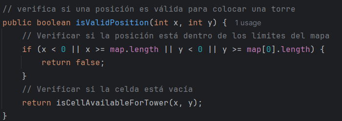

## Clases principales:
- Game: Clase principal que maneja la lógica del juego.

- Map: Representa el mapa del juego.

- Enemy: Clase base para todos los enemigos.

- Tower: Clase base para todas las torres.

- Wave: Maneja las oleadas de enemigos.

- Player: Representa al jugador y sus estadísticas.

## Interfaces y clases de Mocking:
- EnemyFactory: Interfaz para la creación de enemigos (concretas: BasicEnemyFactory,
BossEnemyFactory).

- TowerFactory: Interfaz para la creación de torres (concretas: CannonTowerFactory,
LaserTowerFactory).

## Implementación de pruebas
### Mocks:

- Utiliza Mockito para crear mocks de las clases Enemy y Tower para verificar la interacción
entre objetos.

Creando la clase testEnemyInteractionWithTower():

### Stubs:
- Crea stubs para métodos que devuelven enemigos o torres específicos.
  
Se crea la clase testStubsForEnemyFactory
  

### Fakes:
- Utilizar fakes para simular la base de datos de puntuación o estados de oleadas.

Se crea la clase FakeDatabase

y su test

### Pruebas de mutación:
- Implementa pruebas de mutación para verificar la calidad de las pruebas unitarias.

MapaTest:

WaveTest:

EnemyTest:

- ¿Qué herramienta utilizarías para realizar pruebas de mutación en este proyecto, y cómo la
configurarías?

En este caso usare piptest para las pruebas

- Configura la herramienta de pruebas de mutación para el proyecto y ejecuta un análisis de
mutación en la clase TowerDefenseGame.

Agregamos la configuración al gradle:

### Evaluación de cobertura de pruebas:

- ¿Cómo interpretarías los resultados de las pruebas de mutación y qué acciones tomarías
para mejorar la cobertura de las pruebas?

Ejecutamos el piptest y analizamos el resultado

Estos números indican cuánto del código está cubierto por pruebas 
y qué tan efectivas son esas pruebas para detectar mutaciones 
o errores en el código.

Las acciones que puedo tomar son:

- Identifica áreas del código que no están cubiertas por pruebas y 
crear casos de prueba para esas partes tratando de abordar diferentes 
escenarios y condiciones.

- Implementa mejoras en las pruebas unitarias basándote en los resultados de las pruebas de
mutación y explica las razones de cada cambio.

## Preguntas de diseño e implementación (5 puntos)
### Diseño de la clase Map:
- ¿Cómo implementarías la clase Map para representar el mapa del juego, asegurando que se
puedan agregar y verificar posiciones de torres y caminos?

Primero verificariamos que las coordenadas estén dentro de los límites del mapa. 
Luego, debemos asegurarnos de que la celda esté vacía o no este ocupada por algo más.

- Implementa un método en la clase Map llamado isValidPosition(int x, int y) que verifique si
una posición es válida para colocar una torre.

### Enemigos con diferentes características:
- Diseña e implementa una clase SpeedyEnemy que herede de Enemy y tenga una velocidad
mayor pero menos vida.

- ¿Cómo gestionarías el movimiento de los enemigos en el mapa, asegurando que sigan el
camino predefinido?

Se crea la clase path que se encargara del camino predefinido tambien se agrega la logica de movimiento y algunos atributos a las demás clases

### Torres con diferentes habilidades:
- Implementa una clase SniperTower que tenga un daño alto y un alcance muy largo pero una
velocidad de disparo baja.

- ¿Cómo implementarías el método attack(List<Enemy> enemies) en la clase Tower para
atacar a los enemigos dentro de su alcance?

### Sistema de oleadas:
- ¿Cómo diseñarías la generación de oleadas para que cada oleada sea progresivamente más
difícil?

Para que cada oleada sea progresivamente más difícil, podemos hacer que el 
número y tipo de enemigos aumenten con cada oleada. A medida que avanza el 
juego, las oleadas podrían incluir enemigos más fuertes y en mayor cantidad.

- Implementa un método en la clase Wave llamado spawnEnemies() que genere los enemigos
de la oleada y los coloque en el mapa.

Implementacion del metodo

### Sistema de puntuación y salud de la base:
- ¿Cómo actualizarías la puntuación del jugador y la salud de la base cuando un enemigo es
derrotado o alcanza la base?

Para actualizar la puntuación del jugador y la salud de la base cuando un 
enemigo es derrotado o alcanza la base, se debe implementar un metodo que haga estas acciones.
Este método actualizará la 
puntuación del jugador si el enemigo es derrotado y reducirá la salud de 
la base si el enemigo alcanza la base.

- Implementa un método en la clase Player llamado updateScoreAndHealth(Enemy enemy,
boolean defeated).

Implementación del metodo

## Pruebas estructurales (3 puntos)
Las pruebas estructurales se centran en verificar que el código cumpla con su estructura esperada y
que todas las ramas, condiciones y caminos estén correctamente cubiertos.
### Cobertura de ramas:
- **Ejercicio:** Implementa pruebas para garantizar que todas las ramas del método placeTower
en la clase TowerDefenseGame estén cubiertas.

clase TowerDefenseGame:

clase TowerDefenseGameTest:

### Cobertura de condiciones:
- **Ejercicio:** Escribe pruebas unitarias para verificar todas las condiciones en el método attack
de la clase Tower.

### Cobertura de rutas:
- **Ejercicio:** Implementa pruebas para cubrir todos los caminos posibles en el método
startWave de la clase TowerDefenseGame.

## Preguntas de pruebas con Mockito (2 puntos)
### Mocking de dependencias:
- ¿Cómo usarías Mockito para crear un mock del Map y probar la colocación de torres en la
clase TowerDefenseGame?

Al llamar al método placeTower con una torre y la posición (3,4), 
debería colocar la torre correctamente. Se puede lograr esto mediante 
la creación de un mock de la clase Map y configurando su 
comportamiento para que devuelva la torre esperada cuando se 
consulte la posición (3,4).

- Implementa un test con Mockito para verificar que el método placeTower solo permite
colocar torres en posiciones válidas del mapa.

